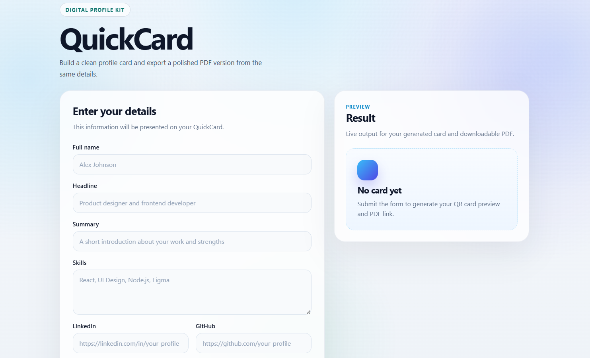
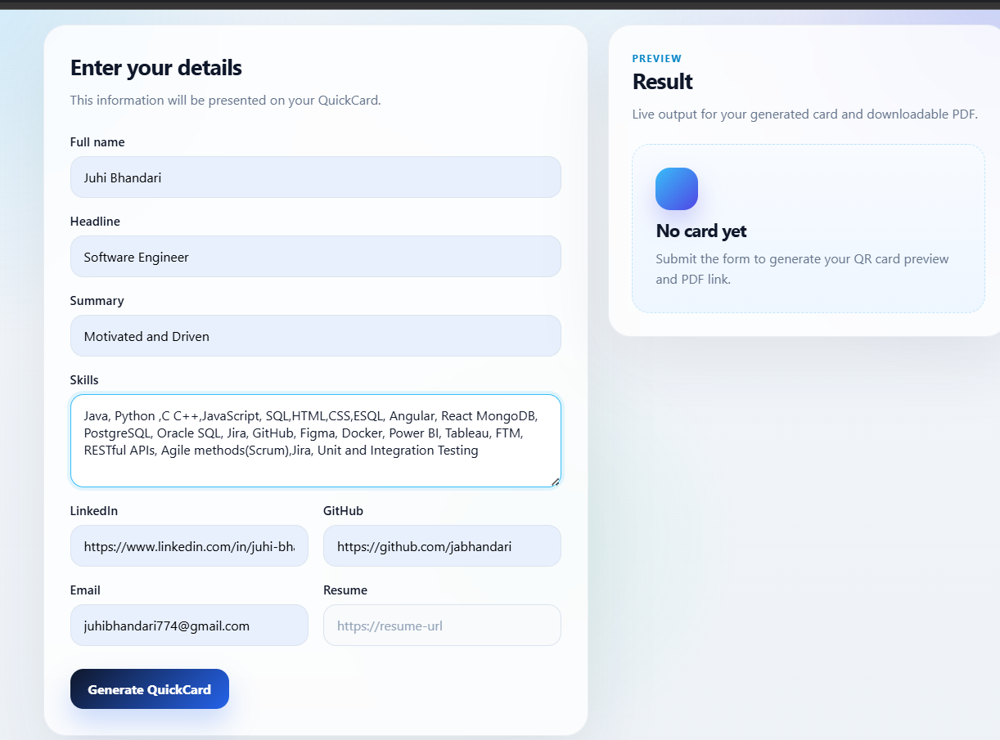
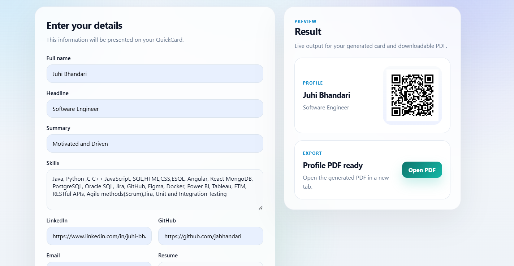
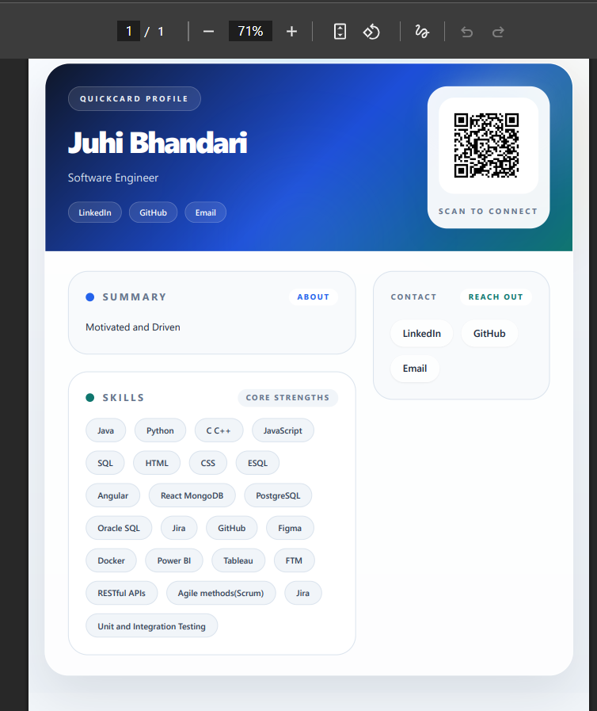

<!-- PROJECT HEADER -->

<br/>

<h3 align="center">QuickCard</h3>

<p align="center">
  A full-stack digital networking card platform that generates shareable profile cards, QR codes, and downloadable PDF resumes.
</p>

<p align="center">
  Turn your professional profile into a shareable digital identity.
</p>

<p align="center">
  <a href="https://github.com/jabhandari/quickcard">View Code</a>
  -
  <a href="https://github.com/jabhandari/quickcard/issues">Report Bug</a>
  -
  <a href="https://github.com/jabhandari/quickcard/issues">Request Feature</a>
</p>

<p align="center">
  <b>Frontend built with React + Vite and backend powered by Node.js + Express.</b>
</p>

<p align="center">
  
  
  
  
</p>

---

## Table of Contents

- [About The Project](#about-the-project)
- [Built With](#built-with)
- [Features](#features)
- [Project Structure](#project-structure)
- [Getting Started](#getting-started)
- [Environment Variables](#environment-variables)
- [API Endpoints](#api-endpoints)
- [Future Improvements](#future-improvements)
- [Author](#author)

---

# About The Project

<p align="center">
  
</p>


**QuickCard** is a full-stack web application that allows users to generate a **digital networking card** with a QR code and downloadable resume.

Instead of manually sharing resumes or LinkedIn links during networking events, QuickCard allows users to quickly create a **shareable professional identity card** that others can scan.

With QuickCard, users can:

- Create a professional profile card
- Generate a QR code linked to their profile
- Download a formatted PDF resume
- Share their digital identity instantly

This project demonstrates a **modern full-stack architecture** with a React frontend and a Node.js/Express backend that dynamically generates QR codes and PDFs.

<p align="center">
  
</p>
---

# Built With

## Frontend

- React
- Vite
- JavaScript
- CSS

## Backend

- Node.js
- Express.js

## Libraries & Tools

- Axios
- Puppeteer (PDF generation)
- QRCode
- dotenv
- cors

---

# Features

## Professional Profile Card

Users can enter their professional information and instantly generate a digital card.

Includes:

- Full name
- Headline / professional title
- Summary
- Skills
- LinkedIn profile

---

## QR Code Identity Sharing

<p align="center">
  
</p>

Each QuickCard generates a **QR code** that links directly to the user's professional profile or portfolio.

Useful for:

- Networking events
- Conferences
- Meetups
- Job fairs

Simply scan and connect.

---

## Resume PDF Generation

Users can generate a **downloadable PDF resume** directly from their profile data.
<p align="center">
  
</p>
Features:

- Dynamic HTML template
- Automated PDF generation
- Ready-to-download resume format
- Includes QR code for profile sharing

---

## Full-Stack Architecture

QuickCard follows a **separated client/server architecture**.

Frontend:

- React interface
- Profile form
- Card preview

Backend:

- REST API
- QR code generation
- PDF generation

---

# Project Structure

```text
quickcard
|-- client/          # React frontend
|   |-- src/
|   |-- components/
|   `-- vite.config.js
|-- server/          # Node + Express backend
|   |-- controllers/
|   |-- routes/
|   |-- wallet/
|   |-- output/
|   `-- server.js
`-- public/          # README images
    |-- img1.png
    |-- img2.png
    |-- img3.png
    `-- img4.png
```

---

# Getting Started

Follow these steps to run the project locally.

---

## Prerequisites

Install:

- Node.js
- npm

Download Node:

https://nodejs.org/

---

# Installation

Clone the repository:

```bash
git clone https://github.com/jabhandari/quickcard.git
cd quickcard
```

Install backend dependencies:

```bash
cd server
npm install
```

Install frontend dependencies:

```bash
cd ../client
npm install
```

## Running the Project

Start the backend:

```bash
cd server
node server.js
```

Start the frontend:

```bash
cd client
npm run dev
```

Open in browser:

```text
http://localhost:5173
```

## Environment Variables

Create a `.env` file inside `server/`:

```env
PORT=5000
APP_URL=http://localhost:5173
```

## API Endpoints

### Generate Card Preview

`POST /api/pass-preview`

Returns:

- Card preview data
- QR code image

### Generate Resume PDF

`POST /api/generate-pdf`

Returns:

- Downloadable resume PDF

### Wallet Pass Prototype

`POST /api/generate-wallet-pass`

Generates a prototype Apple Wallet compatible `pass.json`.

## Future Improvements

Planned features:

- Public profile pages (`/u/:username`)
- Multiple resume templates
- Profile editing
- Cloud database integration
- QR-based networking cards
- Apple Wallet pass integration
- Authentication system
- User dashboard
- Profile analytics

## Author

Juhi Bhandari  
Software Developer  
Toronto, Canada

GitHub:  
https://github.com/jabhandari
